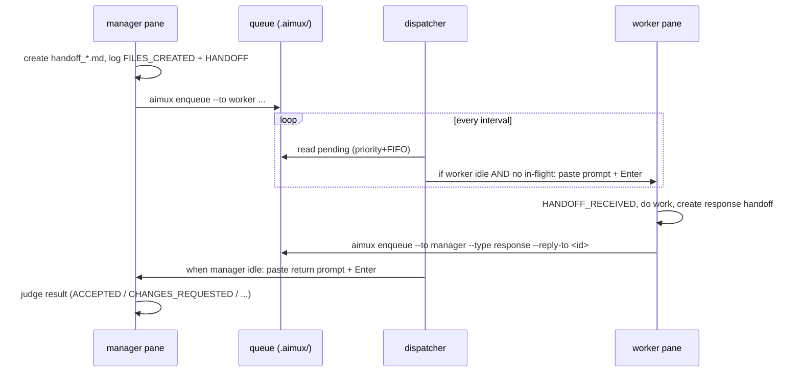

# tmux Handoff Extension (queue-based)

Optional, lazy-loaded transport for AIMemory. It delivers AICP handoffs
between agent panes running in tmux **without doorbell collisions**.

The difference from a naive setup: agents do **not** paste into each other's
panes directly. They enqueue a request; a single **dispatcher** rings a
pane's doorbell only when that pane is idle and has no in-flight delivery.
Many agents can fire requests in parallel — deliveries are serialized.

Read this file only when all of these hold:

1. The current agent is inside tmux (`$TMUX` set, or `tmux display-message
   -p '#{pane_id}'` works).
2. The user asked to enable tmux handoff (`tmux handoff on`), asked to
   deliver/route a handoff to a pane, ran a high-five smoke test, or asked
   to name/rename a pane.
3. The user has not said `tmux handoff off` this session.

Otherwise, use plain AICP handoff files only (see `PROTOCOL.md`).

## Invariants

- **AICP is the source of truth.** Always create the handoff file and append
  `FILES_CREATED` + `HANDOFF` to `work.log` *before* any tmux delivery. tmux
  is convenience transport, not state.
- **Enqueue, never paste directly.** An agent that wants a handoff delivered
  calls `aimux enqueue`. Only the dispatcher (`aimux dispatch`) pastes into a
  pane. This is what prevents two doorbells from colliding.
- **One dispatcher.** Exactly one `aimux dispatch` runs at a time (enforced by
  a flock). It owns every paste.
- **Identity comes from the pasted prompt**, not from shared AIMemory files.
  A receiver is whoever the prompt landed on. Do not infer "which pane am I"
  from `work.log` or handoff files — they are shared by all agents.
- **No secrets, no chain-of-thought** pasted into another pane. Send only the
  handoff path, route facts, roles, and public instructions.

## Roles

- `manager` — the only pane that talks to the human and owns the project end
  to end. Its job is orchestration, not doing the work itself:
  - **Decompose** the task into the most independent units possible, so they
    can run concurrently with minimal cross-dependencies.
  - **Profile the workers.** Track each worker's response time and capability
    (a small/local model is slower and less reliable than a frontier one) from
    `work.log` history and live behavior.
  - **Distribute efficiently.** Assign each unit to the most suitable available
    worker, dispatch independent units in parallel, and keep fast/reliable
    workers busy rather than waiting on a slow one.
  - **Delegate ALL substantive work — implementation, integration, testing, and
    verification** (roles `IMPLEMENT` / `TEST` / `VERIFY`). Producing, editing,
    or running anything is *work*, not judgment: don't write code, don't read the
    code and verify it yourself, don't assemble the build by hand while workers
    can do it — hand out the unit ("write AND RUN a test/harness that checks
    <criteria>, report pass/fail + evidence"; "integrate modules A+B and confirm
    it imports/builds"). Reserve for yourself ONLY the orchestration that has no
    worker equivalent: decomposition, assignment/routing, and the
    accept/re-route **decision from the returned evidence**. "Judgment" =
    reviewing the worker's evidence, not running checks.
  - **Do NOT do the work yourself by default — even if it looks faster.** The
    manager performs a unit directly ONLY when BOTH hold: (a) delegation of that
    unit has genuinely failed **2 or more times** (diagnosed, adapted, retried,
    and re-routed to another capable worker per the failure rule below — not just
    "no idle worker right now"), AND (b) the **user has explicitly approved** the
    manager taking it over. Surface the situation to the user ("unit X failed on
    workers Y and Z — twice; take it over myself?") and wait for approval before
    touching it. Acting as the human to answer a LOW-RISK worker prompt is NOT
    "doing the work" — that's orchestration and needs no approval.
  - **Manage to the finish.** Track outstanding handoffs, re-route or re-issue
    work for a worker that is slow, blocked, or returns a poor result, judge the
    returned evidence, and delegate the final integration/assembly as its own
    unit — escalating to direct work only under the two-failure + approval gate.
- `worker` — a named pane (e.g. `antigravity`, `opencode`, `qwen`) that receives a
  handoff, **faithfully executes exactly the assigned work** within the stated
  action roles, and enqueues its result back to the manager. A worker
  understands the overall flow but does not redefine scope or coordinate —
  that is the manager's job. (See each worker's init file, below.)

There is nothing special in the code about "manager" vs "worker" — the role
is just which pane enqueues to which. The discipline above is what makes the
division of labor work.

## Orchestration strategy (state-based)

The manager runs a closed loop driven by **observed agent state**, not
assumptions. Two inputs:

- `AIMemory/bin/aimux agents` — live board: each agent's `NAME · KIND ·
  idle/busy · what it's HANDLING`. Use it to find an idle, capable agent.
- `AIMemory/agents.md` — the capability & know-how ledger: per-agent strengths,
  known failure modes, and accumulated learnings. **Read before assigning;
  append after every notable success/failure** so the team improves over time.

**Phase 0 — diverge-then-converge planning (non-trivial work, before building):**

0a. **Confirm requirements with the user** — scope, constraints, acceptance
    criteria.
0b. **Everyone drafts their OWN plan, in parallel.** Write the confirmed
    requirements to a file; send it to each worker as a `PROPOSE` handoff
    ("propose YOUR OWN approach — think freely, do NOT implement yet") and, at
    the same time, draft your own plan independently. Collect each
    `REVIEW_RESPONSE` proposal.
0c. **Analyze & synthesize → final plan.** Weigh the strengths/weaknesses of
    the ideas across all proposals (workers' + yours) and combine the best
    parts into the final plan, noting which idea came from where and the
    tradeoffs. The aim is independent divergent thinking then convergence — not
    rubber-stamping one draft. Only then proceed to the loop below.

The loop:

1. **Decompose** the final plan into independent units (incl. test/verify units)
   — by **dependency, not sequence**. "Step 1 → 2 → 3" is narrative order, not a
   dependency graph: serialize only a unit that truly consumes another's output.
   One unit per handoff (a "do A then B then C" bundle hides parallelism inside
   one worker while the rest idle, and one failed sub-step blocks the bundle).
2. **Assign** each unit to a capable agent that is `idle` (per `aimux agents`),
   matched to its strengths (per `agents.md`); dispatch **all currently-unblocked
   units at once** across idle workers, and on each return immediately dispatch
   whatever it unblocked. An idle worker while ready units exist = routing
   failure — split harder (impl vs test harness vs docs, per-module; verify a
   finished unit on one worker WHILE another builds the next).
   Two routing constraints: **(a) sensitive/personal data → qwen ONLY** (local;
   never to the cloud agents claude/opencode/antigravity); **(b) qwen is weak** — give
   it only simple/research/shell-script units, and route main/complex work to
   opencode or antigravity.
3. **Monitor** state, not vibes. A worker going idle ≠ success — the dispatcher
   emits a `notice` when a request is freed with no response. Verify real output.
   If you verify & accept a unit out-of-band (no response handoff came back),
   immediately run `aimux resolve <req-id>` so the dispatcher won't re-surface
   it (no freed-notice, late responses dropped). Never resolve an unfinished
   unit — let the normal flow run.
4. **On failure / poor result: diagnose → adapt → retry once → re-route.**
   Read why it failed (pane + `work.log` + any returned `BLOCKER`). Common,
   recoverable causes:
   - *antigravity/qwen produced nothing* → likely in plan-only edit mode (pane shows
     `Shift+Tab to accept edits`); re-instruct "apply/write the files now" or
     enable accept-edits. (antigravity: also keep tasks single-file/single-step to
     dodge tool-call errors.)
   - *qwen "[done]" but no real action* → it narrated tool calls; tell it to
     "actually RUN the command, don't describe it."
   Retry the same agent once with the adapted instruction; if still bad,
   re-route the unit to another **idle, capable** agent. Either way, append the
   cause + what worked to `agents.md`.
5. **Verify and integrate by delegation, then judge.** Testing the assembled
   build AND the assembly itself are units — hand `VERIFY` / `IMPLEMENT`
   handoffs to idle capable workers ("write AND RUN a test/harness for
   <acceptance criteria>, report pass/fail + evidence"; "integrate the modules
   and confirm it builds"); don't self-test or hand-assemble while workers can.
   Then decide accept/re-route from the returned evidence. Take a unit over
   yourself ONLY after it has failed delegation ≥2× AND the user approves
   (see Roles).

This keeps every capable agent usable (recover via communication, don't blanket-
exclude) and keeps the work flowing to whoever is free and able.

## Pane registry

Routing uses two tmux pane-local user options, so a CLI rewriting its title
can't break routing:

- `@awm_pane_name` — stable routing name (`manager`, `codex`, `antigravity`).
- `@awm_agent_kind` — implementation kind (`claude-code`, `codex`,
  `antigravity`, `opencode`) for behavior switches.

Name the current pane (also pins it on the pane border):

```bash
AIMemory/bin/aimux name codex --kind codex
```

List the roster:

```bash
AIMemory/bin/aimux panes
```

Resolution order for a `--to` target: exact `%pane-id` →
`session:window.pane` → exact `@awm_pane_name` (current window first, then the
whole server, must be unique) → exact `#{pane_title}` (unique fallback). No
fuzzy matching; ambiguous names are refused.

## Flow



### Sending (requesting agent)

1. Infer receiver roles from the user's request (`PROPOSE`, `IMPLEMENT`,
   `REVIEW`, `INSPECT`, `TEST`, `VERIFY`, `FIX`, `GENERAL_STATUS`; combine with
   `+`). `PROPOSE` = draft your own independent plan for the requirements (no
   implementation).
2. Create `AIMemory/handoff_<topic>.<your-model>.md` (AICP header + action
   items), then append `FILES_CREATED` + `HANDOFF` to `work.log`.
3. Enqueue delivery — do **not** paste:

   ```bash
   AIMemory/bin/aimux enqueue \
     --to codex \
     --handoff AIMemory/handoff_<topic>.<your-model>.md \
     --roles IMPLEMENT+TEST
   ```

   `enqueue` logs a `NOTE` with the `req-id`. Note it — the worker cites it in
   `--reply-to` so the dispatcher can match the response to your request.
4. Stop. Do not poll the worker pane. The dispatcher delivers when the worker
   is idle. The worker's durable ack is its `HANDOFF_RECEIVED` event.

### Receiving (worker pane)

When a handoff prompt is pasted into your pane:

1. Identity: you are the receiver; your pane is where the prompt landed. Trust
   the `Route facts` block in the prompt, not shared files.
2. Append `HANDOFF_RECEIVED`, open the exact handoff path from the prompt.
3. Execute the action roles autonomously (see **Autonomy**). Stay within the
   roles — `REVIEW`/`INSPECT`/`TEST`/`VERIFY` do not authorize edits unless
   paired with `IMPLEMENT`/`FIX`.
4. Create the response handoff (`STATUS_REPORT` / `REVIEW_RESPONSE` /
   `BLOCKER_RAISED`), append `FILES_CREATED` + `HANDOFF` + `HANDOFF_CLOSED`.
5. Return it by enqueuing back to the source — do **not** paste:

   ```bash
   AIMemory/bin/aimux enqueue \
     --to manager --type response \
     --reply-to <req-id-from-the-prompt-or-work.log> \
     --handoff AIMemory/handoff_<topic>-report.<your-model>.md \
     --roles GENERAL_STATUS
   ```

### Receiving a return (original source)

When the return prompt is pasted into the manager pane: read the response
handoff, judge it (`ACCEPTED` / `CHANGES_REQUESTED` / `NEEDS_VALIDATION` /
`BLOCKED`) with reason + evidence + next action, and append a `NOTE`. Do not
start follow-up implementation without explicit user approval; if approved,
enqueue a fresh `IMPLEMENT`/`FIX` handoff. (Re-dispatching work to a worker is
a `request`, never `--type response`.)

**Delivery is not receipt.** A return pasted while the manager is mid-turn can
sit unseen in the input buffer. Don't rely on the paste alone: after each turn
re-scan the tail of `work.log` (and `aimux status`) for any worker
`HANDOFF`/return not yet processed, and pick it up. The dispatcher now waits for
a pane to be idle for several consecutive checks before freeing its lock, which
greatly reduces piled-up deliveries, but the manager should still reconcile
against `work.log` as the durable record.

## The dispatcher

Run one, in its own pane/window:

```bash
AIMemory/bin/aimux dispatch            # loop; Ctrl-C to stop
AIMemory/bin/aimux dispatch --once     # single cycle (debug)
AIMemory/bin/aimux dispatch --force    # take over a stale lock (see below)
```

The dispatch pane shows a **live feed** so you can watch the queue move:
`＋ QUEUE` (enqueued) → `▶ DELIVER` (popped to a pane) → `✔ DONE`
(completed/returned), with a `┄ p=N i=M d=K ┄` board line whenever the
pending/inflight/done counts change. Set `AIMUX_VLOG=0` to silence it.

The dispatcher records its PID in `.aimux/dispatch.lock` and traps `HUP`, so it
dies with its pane/server instead of orphaning. If a previous dispatcher ever
leaks and holds the lock, `aimux status` shows the holder PID and
`dispatch --force` kills it and takes over.

**Liveness, not vibes.** Before declaring the dispatcher dead, check
`aimux status`: "running (lock held, PID …)" means it IS alive — a stalled
queue with a live dispatcher is a delivery-guard issue (most often a pane
wait-held or never going idle), not a dead dispatcher. Only "not running (lock
free)" justifies a restart. Every dispatcher exit is logged to `work.log`: a
clean signal stop logs "Dispatcher stopped", anything else logs "Dispatcher
EXITED unexpectedly (rc=N)" — so a vanished dispatch pane is always explained.
The `aimux-up` dispatch pane runs a respawn wrapper: an unexpected (nonzero)
exit restarts the dispatcher after 2s in the same pane; a clean stop drops to
the shell. Never `kill-pane` the dispatch pane to "restart" it.

The launcher `AIMemory/bin/aimux-up` brings up the whole session for you:
a row of named agent panes on top and a dedicated dispatcher pane on the
bottom (so the queue flows automatically). Edit its `AGENTS=(...)` roster, or
pass `AWM_CONFIG=<file>`. The first agent is the manager.

For the whole lifecycle in ONE command, use `AIMemory/bin/aimux shell` (from a
plain terminal): it runs aimux-up, stays attached, and when you detach
(Ctrl-b d) asks — finalize & terminate [Y] / leave running [n] / re-attach [a].
If the session was already finalized inside (`aimux down --yes`), it just
exits. `AWM_SHELL_ON_DETACH=down|keep|ask` picks the answer non-interactively
(no tty defaults to keep — it never kills silently).

Roster entry: `name:command[:init-file]`, or the colon-safe full form
`name|command|init-file|split` (use it when the command contains a colon, e.g.
a model tag like `qwen --model gemma4:e4b`). The command may carry flags; the
CLI kind and init-file are keyed off the first token. The optional init-file is
the agent's **primary brief** — the file that CLI reads on startup. If omitted
it is derived from the CLI kind (`claude`→`CLAUDE.md`,
`codex`/`opencode`/`qwen`→`AGENTS.md`, `antigravity`→`AGENTS.md`).

**Session isolation.** Each launch gets a timestamped session name and its own
state dir `AIMemory/.aimux/<session>` (own queue + dispatch lock). The launcher
prefixes every pane's command with `AIMUX_SESSION=<session>` so `aimux` scopes
pane routing to that session only — concurrent sessions, even with same-named
panes, never cross-deliver. (The env is prefixed on the launch line, not just
exported, so it reaches panes even when the tmux server already exists.)

`split` (full form only) places the pane relative to the PREVIOUS agent:
`h` (default) = new column to the right, `v` = stacked below. The default
roster puts `manager` on the upper-left with the dispatcher pane directly
beneath it (left column), and the workers `antigravity`, `opencode`, `qwen` evenly
stacked down the whole right column (antigravity uses `h` to open the column;
opencode and qwen use `v`; the launcher then equalizes the stack). The
dispatcher height is `AWM_DISPATCH_HEIGHT`% of the window (default 10).

`AWM_AUTO_APPROVE=1` launches Claude Code panes with
`--dangerously-skip-permissions` so auto-delivered handoffs run without
stopping at permission prompts (off by default). Scratch files use
`AIMemory/tmp/` (the launcher sets `TMPDIR` and prefixes it on each CLI), never
`/tmp` — paths outside the project trigger permission prompts; the handoff
prompt and onboarding tell agents the same. On launch each pane is tagged with
`@awm_init_file` (visible in `aimux panes`) and is sent a role-scoped
onboarding message telling it (a) its role — manager vs the specific worker
name, (b) to read **its own** init file first, then `PROTOCOL.md` and this
file, and (c) that its role/identity comes from that message and pasted
prompts, never from shared files. This is what stops panes from confusing who
is the manager at startup.

Each cycle it:

1. Advances in-flight deliveries (releases pane locks — see below).
2. Walks pending requests in priority+FIFO order. For each, it delivers only
   when **both** guards pass:
   - **No in-flight lock** on the target pane (one delivery per pane at a
     time — the primary collision guard).
   - **Pane is idle** — its captured screen tail is stable across one sample
     gap (the secondary guard, so it won't paste mid-turn).

An in-flight delivery's pane lock is released when any of these is true:

- the target enqueued a response with `--reply-to <that-id>` (`response-seen`);
- the manager marked the request closed out-of-band with
  `aimux resolve <req-id>` (`resolved`) — it verified & accepted the output
  itself, so no freed-notice is emitted and late follow-ups are dropped;
- the pane has been idle for `AIMUX_RELEASE_IDLE_CYCLES` consecutive checks
  (`idle-stable`) — a busy sample resets the streak, so a momentarily-stable
  frame can't free the lock while the agent is still working;
- the pane vanished (`pane-gone`) or the hard timeout elapsed (`timeout`).

**Engagement check (anti-duplicate).** Before an idle-stable release the
dispatcher asks: did the target actually ENGAGE with the paste? Either signal
counts: (a) an agent event was appended to `work.log` since delivery, or (b)
the pane was observed **busy** at any point after delivery (`saw_busy` —
delivery only happens into an idle pane, so a later busy frame is a reaction to
the paste). If engaged, the lock is released `idle-stable` (plus the
freed-notice if no response came back — "verify, don't redo"). Only when
NEITHER signal fired (the paste likely sat unsubmitted in the input box) does
the dispatcher re-nudge once with a single-line reminder, then release
`unacked`. Signal (b) matters: a worker that does the work but never writes
`work.log` used to be mis-read as "never picked up" and re-nudged into **doing
the same work again** (duplicate work).

A pane **blocked on a user prompt** (permission / yes-no / choice — matched by
`AIMUX_WAIT_PATTERN`) is "idle *waiting for the user*", not finished: it is
**held** (no idle-release, no re-nudge, never reassigned — so the manager is not
told it is done and does not skip ahead) and receives no new delivery until the
prompt clears. This is distinct from "idle after finishing without a reply"
(which does get the freed-notice/re-nudge). On the `aimux agents` board such a
pane shows as **`waiting`**, never `idle`, so the manager doesn't mistake a
blocked worker for a finished or failed one.

Wait detection matches the **visible screen only — never scrollback**. A prompt
the pane is blocked on right now is by definition on screen; an already-answered
prompt ("Esc to cancel", "(y/n)") that scrolled into history must not re-match,
or the pane would be wait-held forever and every delivery to it would stall.
(The idle stability hash still samples a scrollback tail — harmless there.)

The dispatcher then routes the held prompt by **risk** (a second pattern,
`AIMUX_WAIT_RISK_PATTERN`, over the same visible screen), once per wait episode:

- **Low-risk** (the action behind the prompt is not destructive / irreversible /
  externally-visible / credential-touching — and a bare "always allow / don't ask
  again" option does NOT by itself make it high-risk; a routine permission
  request is low-risk) → after the pane has stayed waiting for
  `AIMUX_WAIT_NOTICE_CYCLES` consecutive checks (a grace window so the REAL
  user can answer it first), it enqueues a high-priority `notice` to the
  **manager** carrying the worker's pane id and an excerpt of the prompt:
  "act as the human — decide and answer it in that pane (`tmux send-keys`), so
  the work keeps flowing." Answering a prompt is the one sanctioned direct paste
  (it is not a handoff). The lock stays held while the manager unblocks it.
- **High-risk** → it does **not** ask the manager to answer; it surfaces the
  prompt to the **real human only** (immediately — surfacing injects nothing)
  and keeps holding. (If the manager reads a low-risk notice and judges it
  actually risky, it escalates instead of answering.)

**Stale-answer protection.** If the user answers the prompt themselves, the
wait episode ends and: a not-yet-emitted notice is never sent; an emitted but
not-yet-delivered notice is **canceled in the queue**; and a notice that already
reached the manager instructs it to FIRST re-check the pane
(`tmux capture-pane`) and do NOTHING if the prompt is gone — a stale answer
sent into a pane that has moved on would be read as new input and trigger
mismatched work.

This keeps a worker from stalling on a trivial confirmation (the manager clears
it) while still routing genuinely consequential decisions to a person. The hard
timeout backstop still applies in both cases. Tune both patterns per CLI/project.

**Idle is not success.** If a *worker request* is released by anything other
than `response-seen` (i.e. the worker went idle / timed out / vanished without
ever returning a response handoff), the dispatcher auto-enqueues a high-priority
`notice` back to the source pane: "worker X freed without a response — verify
its actual output, don't assume completion; accept or re-route." So the manager
is told, instead of having to infer it from "idle."

**Manager already verified it? `aimux resolve`.** The manager often spots the
idle worker FIRST, verifies the output itself, and accepts the unit — before
the dispatcher's release/notice machinery catches up. Without telling the
dispatcher, the manager then gets a freed-notice (and possibly a late worker
response) for a unit it already closed, and re-verifies it: duplicate work.
The moment the manager accepts a unit out-of-band it must run:

```bash
AIMemory/bin/aimux resolve <req-id> [--note "<why>"]
```

Effect: the inflight (if any) is released as `resolved` with NO freed-notice;
any pending notice/response about that request is dropped (`superseded`); and
any follow-up enqueued later is dropped at delivery time. In `aimux report`,
`resolved` counts as completed. If the unit was NOT genuinely completed, do
not resolve — the normal flow (wait for the response, or act on the notice) is
correct.

Because one dispatcher owns every paste and each pane carries a single
in-flight lock, doorbells never overlap — even under many parallel requests.

### Tuning (env vars, all optional)

- `AIMUX_DISPATCH_INTERVAL` (2s) — cycle period.
- `AIMUX_IDLE_SAMPLE_SECS` (1.2s) — screen-stability sample gap.
- `AIMUX_ENTER_SETTLE` (0.4s) / `AIMUX_ENTER_TRIES` (3) — pause around the
  submit Enter and how many times it is re-pressed until the screen visibly
  changes (TUIs ingest a bracketed paste asynchronously; an instant Enter can
  be swallowed with the paste, leaving the prompt unsubmitted).
- `AIMUX_CAPTURE_LINES` (40) — tail lines hashed for idle detection.
- `AIMUX_MIN_INFLIGHT_SECS` (4s) — grace before any idle-based release.
- `AIMUX_WAIT_NOTICE_CYCLES` (2) — consecutive waiting checks before the
  manager is asked to answer a low-risk prompt (user-first grace).
- `AIMUX_INFLIGHT_TIMEOUT` (900s) — hard release fallback.
- `AIMUX_STATE` (`AIMemory/.aimux`) — queue/inflight/done state dir.

Idle detection is heuristic (screen-stable). For a CLI with a distinctive
ready marker you can lengthen `AIMUX_IDLE_SAMPLE_SECS` to reduce false
"idle" during brief pauses.

## Status

For the human, runnable from any terminal (does not need to be inside tmux):

```bash
AIMemory/bin/aimux status
```

Shows the dispatcher state, pending / in-flight / done / failed counts, the
pending and in-flight requests, and (inside tmux) the pane roster.

## Smoke test (high-five)

Proves pane lookup + injection + return without touching AICP files:

```bash
AIMemory/bin/aimux send-test --to codex   # queues a high-five
# (dispatcher delivers it; the target prints the art and enqueues a return)
```

## Autonomy default

tmux handoff is an execution channel, not a clarification channel. A receiver
must make reasonable assumptions and execute when the handoff path, roles, and
pane are explicit. Ask only when: the handoff file is missing/unreadable; the
action is destructive / externally visible / needs credentials; two
incompatible readings would change files materially; or required context is
unrecoverable. Record assumptions in `work.log` or the response handoff.

Autonomy never permits role escalation: without `IMPLEMENT`/`FIX`, do not edit
files and do not self-issue an `IMPLEMENT`/`FIX` handoff. Recommend follow-up
in the response instead.

## On/off

- `tmux handoff on` — clear the disabled flag; if inside tmux, load this file
  and report the current pane id + name.
- `tmux handoff off` — for this session, route through plain AICP only; do not
  enqueue or paste, even if a target says `tmux-pane:<name>`.
